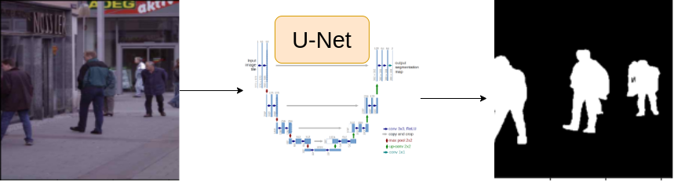

# PyTorch Human Segmentation Project

This is a PyTorch-based project for human segmentation in images. Human segmentation is the task of identifying and segmenting humans in images, separating them from the background. This repository provides a template and guidelines for building your own human segmentation project using PyTorch.



## Table of Contents

- [Introduction](#introduction)
- [Requirements](#requirements)
- [Dataset](#dataset)
- [Getting Started](#getting-started)
  - [Installation](#installation)
  - [Data Preparation](#data-preparation)
- [Training](#training)
- [Inference](#inference)
- [Evaluation](#evaluation)
- [Results](#results)
- [Contributing](#contributing)
- [License](#license)

## Introduction

In this project, we use U-net architecture. The goal is to create a model that can accurately segment humans in images, which can have various applications such as object recognition, image editing, and more.

## Requirements


You can install the required packages using the provided `requirements.txt` file.

```bash
pip install -r requirements.txt
```

## Dataset

To train and evaluate your model, you will need to download the dataset from kaggle using this bash script:
Dataset Credit : https://github.com/VikramShenoy97/Human-Segmentation-Dataset
```bash
bash ./dataset/download_dataset.sh
```

```
dataset/
    ├── Ground_Truth/
    │    ├── 1.jpg
    │    ├── 2.jpg
    │    └── ...
    └── Training_Images/
    |    ├── 1.png
    |    ├── 2.png
    |    └── ...
    |── train.csv
```

## Getting Started

### Installation

Clone this repository:

```bash
git clone https://github.com/wassim249/PyTorch-Human-Segmentation.git
cd PyTorch-Human-Segmentation
```

Install the required dependencies:

```bash
pip install -r requirements.txt
```

### Data Preparation

Prepare your dataset as described in the [Dataset](#dataset) section.

## Training

Train your segmentation model using the following command:

```bash
```bash
python train.py \
  --img_size 128 \
  --data_dir path/to/dataset \
  --batch_size 32 \
  --shuffle True \
  --validation_split 0.2 \
  --num_workers 4 \
  --data_path path/to/dataset \
  --learning_rate 0.001 \
  --weight_decay 0.0001 \
  --ams_grad True \
  --epochs 50 \
  --save_dir checkpoints \
  --tensorboard True \
  --checkpoint_path None

```

You can customize the training parameters as needed.

## Inference

Perform inference on new images using a pre-trained model:

```bash
python inference.py \
  --img_size 128 \
  --data_dir path/to/dataset \
  --batch_size 32 \
  --validation_split 0.2 \
  --num_workers 4 \
  --data_path path/to/dataset \
  --save_dir checkpoints \
  --checkpoint_path ./saved/checkpoint.pth
```

## Evaluation

Evaluate your model's performance using appropriate metrics. You can provide guidance on how to evaluate the segmentation accuracy.

## Results

Showcase the results of your human segmentation model, including example images with segmentation masks.

## Issues

If you encounter any problems or have any inquiries about this project, please open an issue and I will try to respond as soon as possible.